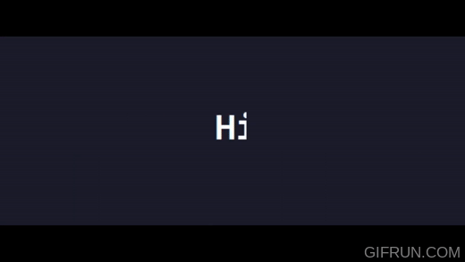

 
 <h3 align="center">Hi, I'm Giancarlos.
  I am a software developer and a normal person who studied computer engineering, a lover of technology and photography.
 
</h3>

  

<pre>
  " Do not take life so seriously, after all you will not survive! "
</pre>

---

### 👨‍💻 About Me:

- 💬 Ask me about **PHP, Mysql, Python, Javascript**

- 📫 How to reach me **informatica.guillen@gmail.com**

- 🌱 I’m currently learning **React.js, Blockchain, Web3 and Solidity**

- 🌐 Website [guillen.cl](www.guillen.cl)

---

<h3 align="left">🔨 Languages and Tools:</h3>
 

                
   

 

 

 

  <h1 align="center">Que la Fuerza te acompañe!</h1>

